# Hasil Scraping Slide Canva: Light Green and White Modern Company Profile (Ingoude Company)

**Sumber Link:** [https://canva.link/x4bj23htogecove](https://canva.link/x4bj23htogecove)  
**Judul Asli:** *Light Green and White Modern Company Profile Presentation*  
**Pemilik / Author:** 9_Aryo Adi Putro  
**Dimensi Kanvas:** 1920 x 1080 px (16:9 Presentation Format)  
**Total Slide:** 15 Halaman  
**Folder Hasil Export Gambar:** [`slides/`](slides/)

---

## 🎨 Sistem Desain & Token Warna (Design System Tokens)

Template ini menggunakan perpaduan visual **Modern Editorial High-Contrast** antara kanvas putih bersih, slate navy pekat, dan aksen **Electric Lime / Neon Yellow-Green**:

| Token Name | Hex Code | Tipe Penggunaan |
| :--- | :--- | :--- |
| **Canvas Background** | `#ffffff` | Latar belakang utama mayoritas slide konten |
| **Dark Slate Navy** | `#122029` | Background hero cover (Slide 1 & 15), header teks, dan pil militer/milestone |
| **Electric Lime Accent** | `#dbff00` | Badge pill, kartu fitur aktif (featured), tab aksen, border aktif |
| **Surface Card Gray** | `#f5f5f5` | Kartu sekunder / non-aktif, surface container |
| **Subtle Slate** | `#2b485f` | Tab aksen gelap, border sekunder |
| **Muted Slate Teal** | `#598196` | Teks keterangan, elemen sekunder |
| **Olive Lime Accent** | `#96ae00` | Tab aksen alternatif pada tab solusi & misi |

### 🔤 Tipografi (Font Families)
1. **Open Sauce**: Digunakan untuk judul utama (Title, Display, Headline) dengan styling uppercase dan bold tracking.
2. **Inter**: Digunakan untuk teks body, deskripsi, paragraf, dan sub-judul.
3. **Canva Sans**: Digunakan untuk teks badge, nomor, dan elemen penjelas.

---

## 📑 Ekstraksi Detail Slide per Slide (15 Slides)

### Slide 1: Cover / Hero
**Archetype Key:** `archetype-canva-cover`  
**Latar Belakang:** `#122029` (Image: [Corporate Office Buildings](https://media-public.canva.com/MADQ5pyWLTY/1/screen_2x.jpg))  
**Deskripsi Layout:** Full-bleed dark corporate background with dark overlay, bold center headline, lime pill badge, and website footer.  

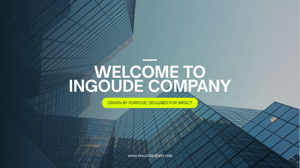

#### 📝 Teks & Konten
- **[title]**: Welcome to Ingoude Company
- **[subtitle]**: Driven by Purpose, Designed for Impact
- **[subtitle]**: www.reallygreatsite.com

#### 🖼️ Aset Visual & Media
- **Blue Shades Linear Gradient**: [`MAFG5E3JH-Y`](https://media-public.canva.com/3JH-Y/MAFG5E3JH-Y/1/s3.svg)

---
### Slide 2: Executive Summary / Title
**Archetype Key:** `archetype-canva-profile`  
**Latar Belakang:** `#ffffff`  
**Deskripsi Layout:** Split layout: left dual floating rounded photo cards with wavy lime ribbon, right 'Company' lime badge, big 'PROFILE' title, year span 2025-2030, and description.  

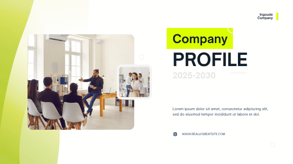

#### 📝 Teks & Konten
- **[do-not-change]**: Company
- **[title]**: profile
- **[heading]**: Ingoude Company
- **[heading]**: Lorem ipsum dolor sit amet, consectetur adipiscing elit, sed do eiusmod tempor incididunt ut labore et dol.
- **[heading]**: 2025-2030
- **[heading]**: www.reallygreatsite.com

#### 🖼️ Aset Visual & Media
- **Asset**: [`MAF_qO-46E4`](https://media-public.canva.com/-46E4/MAF_qO-46E4/1/s3.png)
- **Icon Website**: [`MAFPM4IpyJU`](https://media-public.canva.com/IpyJU/MAFPM4IpyJU/1/s3-1.svg)

---
### Slide 3: About Us / Who We Are
**Archetype Key:** `archetype-canva-welcome`  
**Latar Belakang:** `#ffffff`  
**Deskripsi Layout:** Split layout: left headline 'Who We Are Innovators / Collaborators. Problem-solvers.', subtitle, paragraph; right overlapping dual circular photo masks with bottom wave ribbon.  

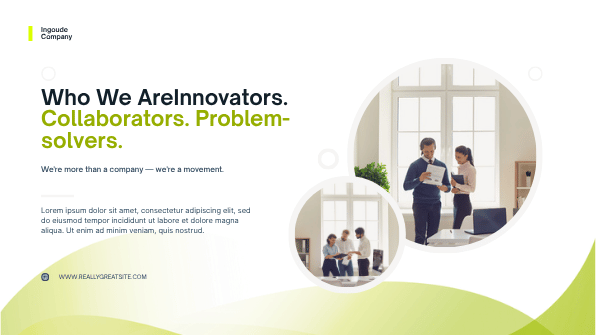

#### 📝 Teks & Konten
- **[pretitle]**: Ingoude Company
- **[title]**: Collaborators. Problem-solvers.
- **[title]**: Who We AreInnovators.
- **[heading]**: We're more than a company — we're a movement.
- **[paragraph]**: Lorem ipsum dolor sit amet, consectetur adipiscing elit, sed do eiusmod tempor incididunt ut labore et dolore magna aliqua. Ut enim ad minim veniam, quis nostrud.
- **[heading]**: www.reallygreatsite.com

#### 🖼️ Aset Visual & Media
- **Asset**: [`MAF_qO-46E4`](https://media-public.canva.com/-46E4/MAF_qO-46E4/1/s3.png)
- **Icon Website**: [`MAFPM4IpyJU`](https://media-public.canva.com/IpyJU/MAFPM4IpyJU/1/s3-1.svg)

---
### Slide 4: Origin Story / Founder Quote
**Archetype Key:** `archetype-canva-story`  
**Latar Belakang:** `#ffffff`  
**Deskripsi Layout:** Centered narrative layout: top title 'Our Origin Story' + 'Founded in 2000', center circular portrait photo, uppercase quote, and CEO attribution.  

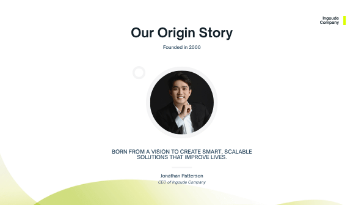

#### 📝 Teks & Konten
- **[pretitle]**: Ingoude Company
- **[title]**: Our Origin Story
- **[heading]**: Founded in 2000
- **[heading]**: Born from a vision to create smart, scalable solutions that improve lives.
- **[heading]**: Jonathan Patterson
- **[heading]**: CEO of Ingoude Company

#### 🖼️ Aset Visual & Media
- **Red Modern Shape Gradient**: [`MAF_pUAezCg`](https://media-public.canva.com/AezCg/MAF_pUAezCg/1/s3.png)

---
### Slide 5: Core Values / Beliefs
**Archetype Key:** `archetype-canva-values`  
**Latar Belakang:** `#ffffff`  
**Deskripsi Layout:** Split layout: left title 'What We Believe' + 5 pill badge values (Integrity, Innovation, Passion, Accountability, Growth) + paragraph; right angled trapezoid team photo.  

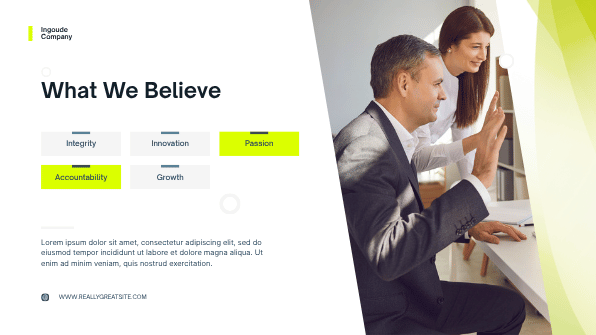

#### 📝 Teks & Konten
- **[title]**: What We Believe
- **[heading]**: Ingoude Company
- **[heading]**: Integrity
- **[heading]**: Innovation
- **[heading]**: Accountability
- **[heading]**: Growth
- **[heading]**: Passion
- **[paragraph]**: Lorem ipsum dolor sit amet, consectetur adipiscing elit, sed do eiusmod tempor incididunt ut labore et dolore magna aliqua. Ut enim ad minim veniam, quis nostrud exercitation.
- **[heading]**: www.reallygreatsite.com

#### 🖼️ Aset Visual & Media
- **Asset**: [`MAF_qALzd4Y`](https://media-public.canva.com/Lzd4Y/MAF_qALzd4Y/1/s3.png)
- **Icon Website**: [`MAFPM4IpyJU`](https://media-public.canva.com/IpyJU/MAFPM4IpyJU/1/s3-1.svg)

---
### Slide 6: Vision Statement
**Archetype Key:** `archetype-canva-vision`  
**Latar Belakang:** `#ffffff`  
**Deskripsi Layout:** Split layout: left title 'Our Vision' + bold statement 'To lead with purpose and inspire progress through innovation' + paragraph; right angled photo.  

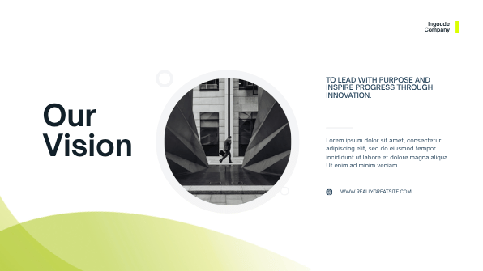

#### 📝 Teks & Konten
- **[title]**: Our Vision
- **[heading]**: Ingoude Company
- **[heading]**: To lead with purpose and inspire progress through innovation.
- **[heading]**: Lorem ipsum dolor sit amet, consectetur adipiscing elit, sed do eiusmod tempor incididunt ut labore et dolore magna aliqua. Ut enim ad minim veniam.
- **[heading]**: www.reallygreatsite.com

#### 🖼️ Aset Visual & Media
- **Asset**: [`MAF_qNoj000`](https://media-public.canva.com/oj000/MAF_qNoj000/1/s3.png)
- **Icon Website**: [`MAFPM4IpyJU`](https://media-public.canva.com/IpyJU/MAFPM4IpyJU/1/s3-1.svg)

---
### Slide 7: Mission Pillars
**Archetype Key:** `archetype-canva-mission`  
**Latar Belakang:** `#ffffff`  
**Deskripsi Layout:** Split layout: left title 'Our Mission' + 3 stacked rectangular cards with colored accent tabs (Lime active card, gray secondary cards); right full photography.  

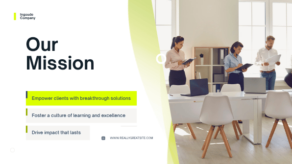

#### 📝 Teks & Konten
- **[pretitle]**: Ingoude Company
- **[title]**: Our Mission
- **[subtitle]**: Empower clients with breakthrough solutions
- **[heading]**: Foster a culture of learning and excellence
- **[heading]**: Drive impact that lasts
- **[heading]**: www.reallygreatsite.com

#### 🖼️ Aset Visual & Media
- **Red Modern Shape Gradient**: [`MAF_pUAezCg`](https://media-public.canva.com/AezCg/MAF_pUAezCg/1/s3.png)
- **Icon Website**: [`MAFPM4IpyJU`](https://media-public.canva.com/IpyJU/MAFPM4IpyJU/1/s3-1.svg)

---
### Slide 8: Services / What We Do
**Archetype Key:** `archetype-canva-services`  
**Latar Belakang:** `#ffffff`  
**Deskripsi Layout:** 3-column card grid: headline 'What We Do' + subtitle 'From concept we deliver:', 3 vertical cards (Custom digital solutions, Business transformation, Smart technology) with top-left accent tabs.  

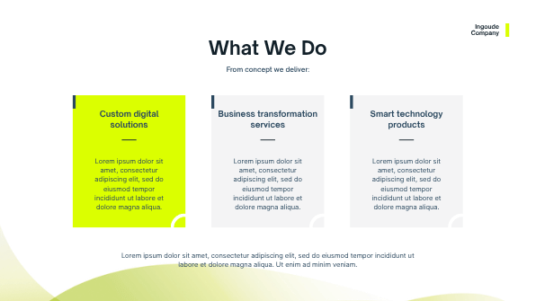

#### 📝 Teks & Konten
- **[paragraph]**: Ingoude Company
- **[title]**: What We Do
- **[heading]**: Custom digital solutions
- **[paragraph]**: Lorem ipsum dolor sit amet, consectetur adipiscing elit, sed do eiusmod tempor incididunt ut labore et dolore magna aliqua.
- **[heading]**: Business transformation services
- **[paragraph]**: Lorem ipsum dolor sit amet, consectetur adipiscing elit, sed do eiusmod tempor incididunt ut labore et dolore magna aliqua.
- **[heading]**: Smart technology products
- **[paragraph]**: Lorem ipsum dolor sit amet, consectetur adipiscing elit, sed do eiusmod tempor incididunt ut labore et dolore magna aliqua.
- **[heading]**: Lorem ipsum dolor sit amet, consectetur adipiscing elit, sed do eiusmod tempor incididunt ut labore et dolore magna aliqua. Ut enim ad minim veniam.
- **[heading]**: From concept we deliver:

#### 🖼️ Aset Visual & Media
- **Red Modern Shape Gradient**: [`MAF_pUAezCg`](https://media-public.canva.com/AezCg/MAF_pUAezCg/1/s3.png)

---
### Slide 9: Solutions / Tabs
**Archetype Key:** `archetype-canva-solutions`  
**Latar Belakang:** `#ffffff`  
**Deskripsi Layout:** Top headline + 4 horizontal solution tabs (Tech Development, Strategic Consulting, Process Optimization, Innovation Labs) + wide panoramic team banner + bottom paragraph.  

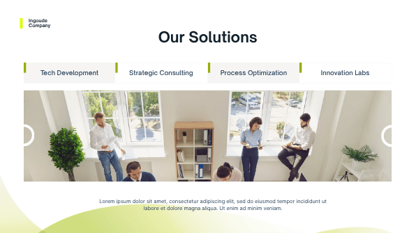

#### 📝 Teks & Konten
- **[pretitle]**: Ingoude Company
- **[title]**: Our Solutions
- **[heading]**: Tech Development
- **[heading]**: Strategic Consulting
- **[heading]**: Process Optimization
- **[heading]**: Innovation Labs
- **[paragraph]**: Lorem ipsum dolor sit amet, consectetur adipiscing elit, sed do eiusmod tempor incididunt ut labore et dolore magna aliqua. Ut enim ad minim veniam.

#### 🖼️ Aset Visual & Media
- **Red Modern Shape Gradient**: [`MAF_pUAezCg`](https://media-public.canva.com/AezCg/MAF_pUAezCg/1/s3.png)

---
### Slide 10: Clients / Case Studies
**Archetype Key:** `archetype-canva-clients`  
**Latar Belakang:** `#ffffff`  
**Deskripsi Layout:** 3-column client cards: title 'Our Clients', 3 vertical cards with circular client photos (Thynk Unlimited, Studio Shodwe [featured lime card], Hanover and Tyke).  

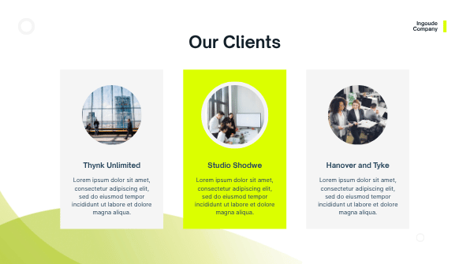

#### 📝 Teks & Konten
- **[paragraph]**: Ingoude Company
- **[heading]**: Our Clients
- **[heading]**: Thynk Unlimited
- **[paragraph]**: Lorem ipsum dolor sit amet, consectetur adipiscing elit, sed do eiusmod tempor incididunt ut labore et dolore magna aliqua.
- **[heading]**: Studio Shodwe
- **[paragraph]**: Lorem ipsum dolor sit amet, consectetur adipiscing elit, sed do eiusmod tempor incididunt ut labore et dolore magna aliqua.
- **[heading]**: Hanover and Tyke
- **[paragraph]**: Lorem ipsum dolor sit amet, consectetur adipiscing elit, sed do eiusmod tempor incididunt ut labore et dolore magna aliqua.

#### 🖼️ Aset Visual & Media
- **Asset**: [`MAF_qNoj000`](https://media-public.canva.com/oj000/MAF_qNoj000/1/s3.png)

---
### Slide 11: Why Choose Us
**Archetype Key:** `archetype-canva-differentiator`  
**Latar Belakang:** `#ffffff`  
**Deskripsi Layout:** Split layout: left title 'Why Choose Us' + 3 feature pill cards (Agile and adaptive teams, Proven track record [lime], Our fast growing company); right dual overlapping circular photos.  

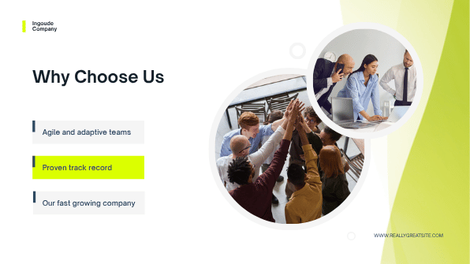

#### 📝 Teks & Konten
- **[pretitle]**: Ingoude Company
- **[title]**: Why Choose Us
- **[subtitle]**: Agile and adaptive teams
- **[heading]**: Proven track record
- **[heading]**: Our fast growing company
- **[heading]**: www.reallygreatsite.com

#### 🖼️ Aset Visual & Media
- **Red Modern Shape Gradient**: [`MAF_pUAezCg`](https://media-public.canva.com/AezCg/MAF_pUAezCg/1/s3.png)

---
### Slide 12: Team Showcase
**Archetype Key:** `archetype-canva-team`  
**Latar Belakang:** `#ffffff`  
**Deskripsi Layout:** Unified container card with 3 equal columns: title 'Meet the Team', Juliana Silva (COO), Adora Montminy (CEO), Korina Villanueva (CFO) with circular portraits and role titles.  

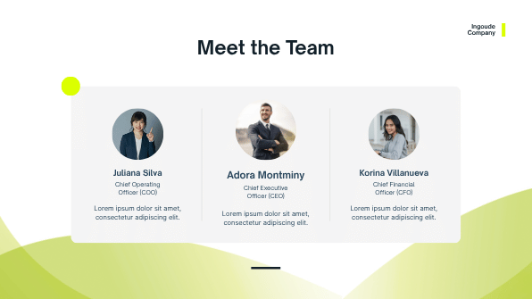

#### 📝 Teks & Konten
- **[paragraph]**: Ingoude Company
- **[title]**: Meet the Team
- **[heading]**: Juliana Silva
- **[paragraph]**: Chief Operating Officer (COO)
- **[heading]**: Lorem ipsum dolor sit amet, consectetur adipiscing elit.
- **[heading]**: Adora Montminy
- **[paragraph]**: Chief Executive Officer (CEO)
- **[heading]**: Lorem ipsum dolor sit amet, consectetur adipiscing elit.
- **[heading]**: Korina Villanueva
- **[paragraph]**: Chief Financial Officer (CFO)
- **[heading]**: Lorem ipsum dolor sit amet, consectetur adipiscing elit.

#### 🖼️ Aset Visual & Media
- **Asset**: [`MAF_qNoj000`](https://media-public.canva.com/oj000/MAF_qNoj000/1/s3.png)
- **Asset**: [`MAF_qNoj000`](https://media-public.canva.com/oj000/MAF_qNoj000/1/s3.png)

---
### Slide 13: Milestones / Roadmap
**Archetype Key:** `archetype-canva-milestones`  
**Latar Belakang:** `#ffffff`  
**Deskripsi Layout:** Split layout: left title 'Our Milestones' + paragraph; right 3 diagonal stepped pills with lime circle year badges (2015, 2022, 2028) and dark capsule body.  

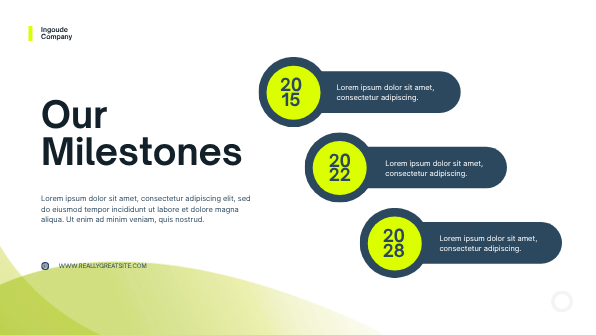

#### 📝 Teks & Konten
- **[heading]**: Ingoude Company
- **[title]**: Our Milestones
- **[paragraph]**: Lorem ipsum dolor sit amet, consectetur adipiscing elit, sed do eiusmod tempor incididunt ut labore et dolore magna aliqua. Ut enim ad minim veniam, quis nostrud.
- **[heading]**: www.reallygreatsite.com
- **[do-not-change]**: 2015
- **[heading]**: Lorem ipsum dolor sit amet, consectetur adipiscing.
- **[do-not-change]**: 2022
- **[heading]**: Lorem ipsum dolor sit amet, consectetur adipiscing.
- **[do-not-change]**: 2028
- **[heading]**: Lorem ipsum dolor sit amet, consectetur adipiscing.

#### 🖼️ Aset Visual & Media
- **Infographic Element**: [`MAFvVLYphvc`](https://media-public.canva.com/Yphvc/MAFvVLYphvc/1/s3-1.svg)
- **Infographic Element**: [`MAFvVLYphvc`](https://media-public.canva.com/Yphvc/MAFvVLYphvc/1/s3-1.svg)
- **Infographic Element**: [`MAFvVLYphvc`](https://media-public.canva.com/Yphvc/MAFvVLYphvc/1/s3-1.svg)
- **Asset**: [`MAF_qNoj000`](https://media-public.canva.com/oj000/MAF_qNoj000/1/s3.png)
- **Icon Website**: [`MAFPM4IpyJU`](https://media-public.canva.com/IpyJU/MAFPM4IpyJU/1/s3-1.svg)

---
### Slide 14: Contact / CTA
**Archetype Key:** `archetype-canva-closing`  
**Latar Belakang:** `#ffffff`  
**Deskripsi Layout:** Split layout: left 'Don't Hesitate To Contact Us' + 3 icon-contact rows (Website, Email, Phone) + note; right angled photo of professional with lime ribbons.  

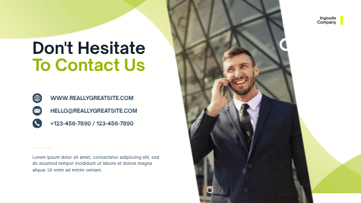

#### 📝 Teks & Konten
- **[paragraph]**: Ingoude Company
- **[title]**: Don't Hesitate
- **[title]**: To Contact Us
- **[paragraph]**: Lorem ipsum dolor sit amet, consectetur adipiscing elit, sed do eiusmod tempor incididunt ut labore et dolore magna aliqua. Ut enim ad minim veniam.
- **[heading]**: www.reallygreatsite.com
- **[heading]**: hello@reallygreatsite.com
- **[heading]**: +123-456-7890 / 123-456-7890

#### 🖼️ Aset Visual & Media
- **Asset**: [`MAF_qNoj000`](https://media-public.canva.com/oj000/MAF_qNoj000/1/s3.png)
- **Asset**: [`MAF_qNoj000`](https://media-public.canva.com/oj000/MAF_qNoj000/1/s3.png)
- **web icon**: [`MAFX5vnPABo`](https://media-public.canva.com/nPABo/MAFX5vnPABo/1/s3-1.svg)
- **Telephone Call Icon**: [`MAEsPmLqcQc`](https://media-public.canva.com/LqcQc/MAEsPmLqcQc/1/s3-1.svg)
- **email icon**: [`MAFX5oKmLdo`](https://media-public.canva.com/KmLdo/MAFX5oKmLdo/1/s3-1.svg)

---
### Slide 15: Closing Thank You
**Archetype Key:** `archetype-canva-thankyou`  
**Latar Belakang:** `#122029` (Image: [Corporate Office Buildings](https://media-public.canva.com/MADQ5pyWLTY/1/screen_2x.jpg))  
**Deskripsi Layout:** Full-bleed dark corporate background mirroring Slide 1: bold centered 'THANK YOU SO MUCH!' in white + website URL.  

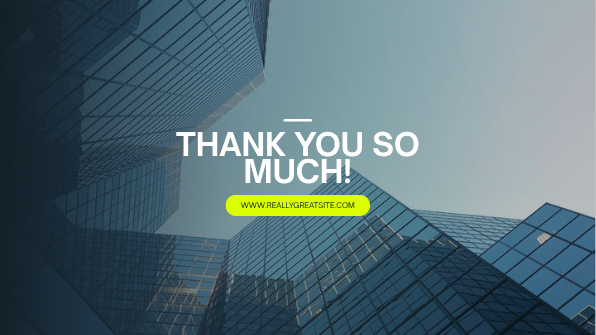

#### 📝 Teks & Konten
- **[title]**: thank you so much!
- **[subtitle]**: www.reallygreatsite.com

#### 🖼️ Aset Visual & Media
- **Blue Shades Linear Gradient**: [`MAFG5E3JH-Y`](https://media-public.canva.com/3JH-Y/MAFG5E3JH-Y/1/s3.svg)

---
