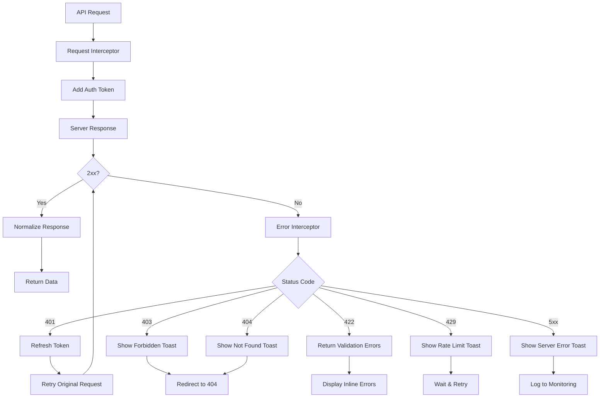

## Overview

The application uses a centralized **API client** (Axios) with interceptors for authentication, logging, and error normalization. Data fetching is abstracted through custom React hooks providing type-safe, cached, and optimistic updates.


---

## 1. API Client Configuration (`services/apiClient.ts`)

```typescript
import axios, { AxiosInstance, AxiosRequestConfig, AxiosError } from 'axios';
import { useAuthStore } from '@/stores/useAuthStore';
import { ErrorResponse } from '@/types/api';

const API_BASE_URL = import.meta.env.VITE_API_BASE_URL || '/api';

class ApiClient {
  private client: AxiosInstance;
  
  constructor() {
    this.client = axios.create({
      baseURL: API_BASE_URL,
      timeout: 30000,
      headers: {
        'Content-Type': 'application/json',
      },
      withCredentials: false, // Set true if using cookies
    });
    
    this.setupInterceptors();
  }
  
  private setupInterceptors() {
    // Request: Add auth token
    this.client.interceptors.request.use(
      (config) => {
        const { tokens } = useAuthStore.getState();
        if (tokens?.accessToken) {
          config.headers.Authorization = `Bearer ${tokens.accessToken}`;
        }
        return config;
      },
      (error) => Promise.reject(error)
    );
    
    // Response: Normalize errors
    this.client.interceptors.response.use(
      (response) => response,
      async (error: AxiosError<ErrorResponse>) => {
        const originalRequest = error.config as AxiosRequestConfig & { _retry?: boolean };
        
        // Handle 401 - Token expired
        if (error.response?.status === 401 && !originalRequest._retry) {
          originalRequest._retry = true;
          
          try {
            await useAuthStore.getState().refreshTokens();
            const { tokens } = useAuthStore.getState();
            if (tokens?.accessToken && originalRequest.headers) {
              originalRequest.headers.Authorization = `Bearer ${tokens.accessToken}`;
            }
            return this.client(originalRequest);
          } catch {
            useAuthStore.getState().logout();
            window.location.href = '/login';
            return Promise.reject(error);
          }
        }
        
        // Normalize error
        const normalizedError: ErrorResponse = {
          code: error.response?.data?.code || 'UNKNOWN_ERROR',
          message: error.response?.data?.message || error.message || 'An unexpected error occurred',
          details: error.response?.data?.details,
          status: error.response?.status || 500,
          timestamp: new Date().toISOString(),
          path: error.config?.url || 'unknown',
        };
        
        // Show toast for non-4xx errors (handled by hooks)
        if (normalizedError.status >= 500) {
          useAppStore.getState().addToast({
            type: 'error',
            title: 'Server Error',
            description: normalizedError.message,
          });
        }
        
        return Promise.reject(normalizedError);
      }
    );
  }
  
  // Generic methods
  get<T>(url: string, config?: AxiosRequestConfig) {
    return this.client.get<T>(url, config);
  }
  
  post<T>(url: string, data?: unknown, config?: AxiosRequestConfig) {
    return this.client.post<T>(url, data, config);
  }
  
  put<T>(url: string, data?: unknown, config?: AxiosRequestConfig) {
    return this.client.put<T>(url, data, config);
  }
  
  patch<T>(url: string, data?: unknown, config?: AxiosRequestConfig) {
    return this.client.patch<T>(url, data, config);
  }
  
  delete<T>(url: string, config?: AxiosRequestConfig) {
    return this.client.delete<T>(url, config);
  }
  
  // File upload
  upload<T>(url: string, formData: FormData, onProgress?: (progress: number) => void) {
    return this.client.post<T>(url, formData, {
      headers: { 'Content-Type': 'multipart/form-data' },
      onUploadProgress: (e) => {
        if (e.total && onProgress) {
          onProgress(Math.round((e.loaded * 100) / e.total));
        }
      },
    });
  }
}

export const apiClient = new ApiClient();
```

---

## 2. Custom Hooks

### useFetchData — Generic Data Fetching
```typescript
import { useQuery, UseQueryOptions, UseQueryResult } from '@tanstack/react-query';
import { apiClient } from '@/services/apiClient';
import { PaginatedResponse, ErrorResponse } from '@/types/api';

interface FetchOptions<T> extends Omit<UseQueryOptions<T, ErrorResponse>, 'queryKey' | 'queryFn'> {
  params?: Record<string, unknown>;
  enabled?: boolean;
}

export function useFetchData<T>(
  endpoint: string,
  options: FetchOptions<T> = {}
): UseQueryResult<T, ErrorResponse> {
  const { params, enabled = true, ...queryOptions } = options;
  
  return useQuery<T, ErrorResponse>({
    queryKey: [endpoint, params],
    queryFn: async () => {
      const response = await apiClient.get<T>(endpoint, { params });
      return response.data;
    },
    enabled,
    staleTime: 5 * 60 * 1000, // 5 minutes
    gcTime: 10 * 60 * 1000, // 10 minutes
    retry: (failureCount, error) => {
      if (error.status === 401 || error.status === 403) return false;
      return failureCount < 3;
    },
    ...queryOptions,
  });
}
```

**Usage:**
```tsx
// Single resource
const { data: user, isLoading, error } = useFetchData<User>('/users/123');

// Paginated list
const { data, isLoading } = useFetchData<PaginatedResponse<Product>>('/products', {
  params: { page: 1, limit: 20, search: 'query' },
});

// Conditional fetch
const { data } = useFetchData<User>('/users/me', {
  enabled: isAuthenticated,
});
```

---

### useInfiniteQuery — Infinite Scroll / Pagination
```typescript
import { useInfiniteQuery, UseInfiniteQueryOptions } from '@tanstack/react-query';
import { apiClient } from '@/services/apiClient';
import { PaginatedResponse, ErrorResponse } from '@/types/api';

interface InfiniteFetchOptions<T> 
  extends Omit<UseInfiniteQueryOptions<T, ErrorResponse>, 'queryKey' | 'queryFn' | 'getNextPageParam'> {
  params?: Record<string, unknown>;
}

export function useInfiniteFetch<T>(
  endpoint: string,
  options: InfiniteFetchOptions<PaginatedResponse<T>> = {}
) {
  const { params, ...queryOptions } = options;
  
  return useInfiniteQuery<PaginatedResponse<T>, ErrorResponse>({
    queryKey: [endpoint, params],
    queryFn: async ({ pageParam = 1 }) => {
      const response = await apiClient.get<PaginatedResponse<T>>(endpoint, {
        params: { ...params, page: pageParam },
      });
      return response.data;
    },
    getNextPageParam: (lastPage) => {
      return lastPage.meta.hasNext ? lastPage.meta.page + 1 : undefined;
    },
    initialPageParam: 1,
    staleTime: 5 * 60 * 1000,
    ...queryOptions,
  });
}
```

**Usage:**
```tsx
const { data, fetchNextPage, hasNextPage, isFetchingNextPage } = useInfiniteFetch<Product>('/products');

return (
  <div>
    {data?.pages.flatMap(page => page.data).map(product => (
      <ProductCard key={product.id} product={product} />
    ))}
    {hasNextPage && (
      <Button onClick={() => fetchNextPage()} loading={isFetchingNextPage}>
        Load More
      </Button>
    )}
  </div>
);
```

---

### useMutation — Create/Update/Delete
```typescript
import { useMutation, UseMutationOptions, UseMutateFunction } from '@tanstack/react-query';
import { apiClient } from '@/services/apiClient';
import { ErrorResponse } from '@/types/api';
import { useAppStore } from '@/stores/useAppStore';

interface MutationOptions<TData, TVariables> 
  extends Omit<UseMutationOptions<TData, ErrorResponse, TVariables>, 'mutationFn'> {
  onSuccessToast?: string | ((data: TData) => string);
  onErrorToast?: string | ((error: ErrorResponse) => string);
  invalidateKeys?: string[][];
}

export function useMutation<TData, TVariables>(
  mutationFn: (variables: TVariables) => Promise<TData>,
  options: MutationOptions<TData, TVariables> = {}
): UseMutateFunction<TData, ErrorResponse, TVariables> & { mutate: UseMutateFunction<TData, ErrorResponse, TVariables>['mutate'] } {
  const { addToast } = useAppStore();
  const { onSuccessToast, onErrorToast, invalidateKeys, ...mutationOptions } = options;
  
  const mutation = useMutation<TData, ErrorResponse, TVariables>({
    mutationFn,
    onSuccess: (data, variables, context) => {
      if (onSuccessToast) {
        addToast({
          type: 'success',
          title: 'Success',
          description: typeof onSuccessToast === 'function' ? onSuccessToast(data) : onSuccessToast,
        });
      }
      // Invalidate related queries
      if (invalidateKeys) {
        invalidateKeys.forEach(key => {
          queryClient.invalidateQueries({ queryKey: key });
        });
      }
      options.onSuccess?.(data, variables, context);
    },
    onError: (error, variables, context) => {
      addToast({
        type: 'error',
        title: 'Error',
        description: typeof onErrorToast === 'function' ? onErrorToast(error) : onErrorToast || error.message,
      });
      options.onError?.(error, variables, context);
    },
    ...mutationOptions,
  });
  
  return mutation;
}
```

**Usage:**
```tsx
const createUser = useMutation<User, CreateUserData>(
  (data) => apiClient.post<User>('/users', data),
  {
    onSuccessToast: 'User created successfully',
    onErrorToast: (error) => `Failed to create user: ${error.message}`,
    invalidateKeys: [['/users']],
  }
);

const updateUser = useMutation<User, UpdateUserData>(
  ({ id, ...data }) => apiClient.put<User>(`/users/${id}`, data),
  {
    onSuccessToast: (data) => `User ${data.name} updated`,
    invalidateKeys: [['/users'], ['/users', data.id]],
  }
);

const deleteUser = useMutation<void, string>(
  (id) => apiClient.delete<void>(`/users/${id}`),
  {
    onSuccessToast: 'User deleted',
    invalidateKeys: [['/users']],
  }
);
```

---

### useOptimisticUpdate — Optimistic UI
```typescript
import { useMutation, useQueryClient, QueryKey } from '@tanstack/react-query';

interface OptimisticOptions<TData, TVariables> {
  queryKey: QueryKey;
  mutationFn: (variables: TVariables) => Promise<TData>;
  onMutate: (variables: TVariables) => Partial<TData>;
  onError?: (error: Error, variables: TVariables, context: unknown) => void;
  onSettled?: () => void;
}

export function useOptimisticUpdate<TData, TVariables>({
  queryKey,
  mutationFn,
  onMutate,
  onError,
  onSettled,
}: OptimisticOptions<TData, TVariables>) {
  const queryClient = useQueryClient();
  
  return useMutation<TData, Error, TVariables>({
    mutationFn,
    onMutate: async (variables) => {
      // Cancel outgoing refetches
      await queryClient.cancelQueries({ queryKey });
      
      // Snapshot previous value
      const previousData = queryClient.getQueryData<TData>(queryKey);
      
      // Optimistically update
      const optimisticUpdate = onMutate(variables);
      queryClient.setQueryData<TData>(queryKey, (old) => ({
        ...old!,
        ...optimisticUpdate,
      }));
      
      return { previousData };
    },
    onError: (error, variables, context) => {
      // Rollback on error
      if (context?.previousData) {
        queryClient.setQueryData(queryKey, context.previousData);
      }
      onError?.(error, variables, context);
    },
    onSettled: () => {
      queryClient.invalidateQueries({ queryKey });
      onSettled?.();
    },
  });
}
```

**Usage:**
```tsx
const toggleUserStatus = useOptimisticUpdate<User, { id: string; isActive: boolean }>({
  queryKey: ['/users', userId],
  mutationFn: ({ id, isActive }) => apiClient.patch<User>(`/users/${id}`, { isActive }),
  onMutate: ({ isActive }) => ({ isActive }),
});
```

---

## 3. Feature-Specific API Hooks

### Auth API (`features/auth/api/authApi.ts`)
```typescript
import { apiClient } from '@/services/apiClient';
import { LoginCredentials, RegisterCredentials, AuthTokens, User } from '@/types/auth';

export const authApi = {
  login: (credentials: LoginCredentials) => 
    apiClient.post<{ user: User; tokens: AuthTokens }>('/auth/login', credentials),
  
  register: (data: RegisterCredentials) => 
    apiClient.post<{ user: User; tokens: AuthTokens }>('/auth/register', data),
  
  logout: () => apiClient.post<void>('/auth/logout'),
  
  refreshToken: (refreshToken: string) => 
    apiClient.post<{ tokens: AuthTokens }>('/auth/refresh', { refreshToken }),
  
  me: () => apiClient.get<User>('/auth/me'),
  
  forgotPassword: (email: string) => 
    apiClient.post<void>('/auth/forgot-password', { email }),
  
  resetPassword: (token: string, password: string) => 
    apiClient.post<void>('/auth/reset-password', { token, password }),
  
  clearTokens: () => {
    // Called on logout to clear interceptor state
  },
};
```

### Users API (`features/users/api/usersApi.ts`)
```typescript
import { apiClient } from '@/services/apiClient';
import { User, UserFilters, PaginatedResponse, CreateUserData, UpdateUserData } from '@/features/users/types';

export const usersApi = {
  list: (filters?: UserFilters) => 
    apiClient.get<PaginatedResponse<User>>('/users', { params: filters }),
  
  get: (id: string) => apiClient.get<User>(`/users/${id}`),
  
  create: (data: CreateUserData) => apiClient.post<User>('/users', data),
  
  update: (id: string, data: UpdateUserData) => 
    apiClient.put<User>(`/users/${id}`, data),
  
  delete: (id: string) => apiClient.delete<void>(`/users/${id}`),
  
  bulkDelete: (ids: string[]) => apiClient.post<void>('/users/bulk-delete', { ids }),
  
  export: (filters?: UserFilters) => 
    apiClient.get<Blob>('/users/export', { 
      params: filters, 
      responseType: 'blob' 
    }),
};
```

---

## 4. Error Handling Strategy

### Global Error Types
```typescript
export type ErrorCode = 
  | 'VALIDATION_ERROR'
  | 'UNAUTHORIZED'
  | 'FORBIDDEN'
  | 'NOT_FOUND'
  | 'CONFLICT'
  | 'RATE_LIMITED'
  | 'SERVER_ERROR'
  | 'NETWORK_ERROR'
  | 'UNKNOWN_ERROR';

export interface ErrorResponse {
  code: ErrorCode;
  message: string;
  details?: Record<string, string[]>;
  status: number;
  timestamp: string;
  path: string;
}
```

### Error Handling Flow



---

## 5. Request/Response Type Mapping

| Endpoint | Request Type | Response Type | Hook |
|----------|--------------|---------------|------|
| `GET /users` | `UserFilters` | `PaginatedResponse<User>` | `useUsers` |
| `GET /users/:id` | - | `User` | `useUser` |
| `POST /users` | `CreateUserData` | `User` | `useCreateUser` |
| `PUT /users/:id` | `UpdateUserData` | `User` | `useUpdateUser` |
| `DELETE /users/:id` | - | `void` | `useDeleteUser` |
| `GET /products` | `ProductFilters` | `PaginatedResponse<Product>` | `useProducts` |
| `GET /orders` | `OrderFilters` | `PaginatedResponse<Order>` | `useOrders` |
| `POST /auth/login` | `LoginCredentials` | `{ user: User; tokens: AuthTokens }` | `useLogin` |
| `POST /auth/refresh` | `{ refreshToken: string }` | `{ tokens: AuthTokens }` | Auto (interceptor) |

---

## 6. API Endpoints Reference

```typescript
export const ENDPOINTS = {
  // Auth
  AUTH: {
    LOGIN: '/auth/login',
    REGISTER: '/auth/register',
    LOGOUT: '/auth/logout',
    REFRESH: '/auth/refresh',
    ME: '/auth/me',
    FORGOT_PASSWORD: '/auth/forgot-password',
    RESET_PASSWORD: '/auth/reset-password',
  },
  
  // Users
  USERS: {
    LIST: '/users',
    GET: (id: string) => `/users/${id}`,
    CREATE: '/users',
    UPDATE: (id: string) => `/users/${id}`,
    DELETE: (id: string) => `/users/${id}`,
    BULK_DELETE: '/users/bulk-delete',
    EXPORT: '/users/export',
  },
  
  // Products
  PRODUCTS: {
    LIST: '/products',
    GET: (id: string) => `/products/${id}`,
    CREATE: '/products',
    UPDATE: (id: string) => `/products/${id}`,
    DELETE: (id: string) => `/products/${id}`,
  },
  
  // Orders
  ORDERS: {
    LIST: '/orders',
    GET: (id: string) => `/orders/${id}`,
    UPDATE_STATUS: (id: string) => `/orders/${id}/status`,
  },
  
  // Upload
  UPLOAD: {
    IMAGE: '/upload/image',
    DOCUMENT: '/upload/document',
  },
} as const;
```

---

## 7. Testing API Hooks

### Mocking with MSW
```typescript
import { http, HttpResponse } from 'msw';
import { setupServer } from 'msw/node';
import { renderHook, waitFor } from '@testing-library/react';
import { useFetchData } from '../useFetchData';
import { QueryClient, QueryClientProvider } from '@tanstack/react-query';

const server = setupServer(
  http.get('/api/users', () => {
    return HttpResponse.json({
      data: [{ id: '1', name: 'John', email: 'john@test.com', role: 'USER' }],
      meta: { page: 1, limit: 20, total: 1, totalPages: 1, hasNext: false, hasPrev: false },
    });
  })
);

beforeAll(() => server.listen());
afterEach(() => server.resetHandlers());
afterAll(() => server.close());

it('fetches users successfully', async () => {
  const queryClient = new QueryClient();
  const wrapper = ({ children }: { children: React.ReactNode }) => (
    <QueryClientProvider client={queryClient}>{children}</QueryClientProvider>
  );
  
  const { result } = renderHook(() => useFetchData<PaginatedResponse<User>>('/users'), { wrapper });
  
  await waitFor(() => expect(result.current.isSuccess).toBe(true));
  expect(result.current.data?.data).toHaveLength(1);
});
```

---

## 8. Rate Limiting & Retry

```typescript
const client = axios.create({
  // ...
});

// Retry configuration
client.interceptors.response.use(
  (response) => response,
  (error) => {
    const config = error.config;
    
    // Retry on network errors or 5xx
    if (!config || config._retryCount >= 3) return Promise.reject(error);
    
    const shouldRetry = 
      !error.response || // Network error
      error.response.status >= 500 || // Server error
      error.response.status === 429; // Rate limited
    
    if (shouldRetry) {
      config._retryCount = (config._retryCount || 0) + 1;
      
      // Exponential backoff
      const delay = Math.min(1000 * 2 ** config._retryCount, 10000);
      return new Promise(resolve => setTimeout(resolve, delay))
        .then(() => client(config));
    }
    
    return Promise.reject(error);
  }
);
```

---

