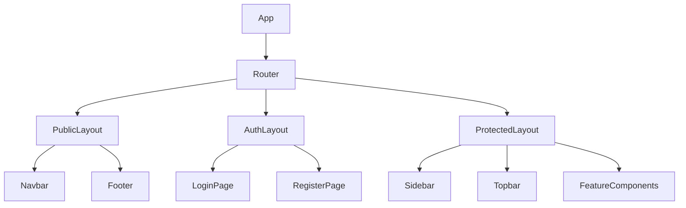
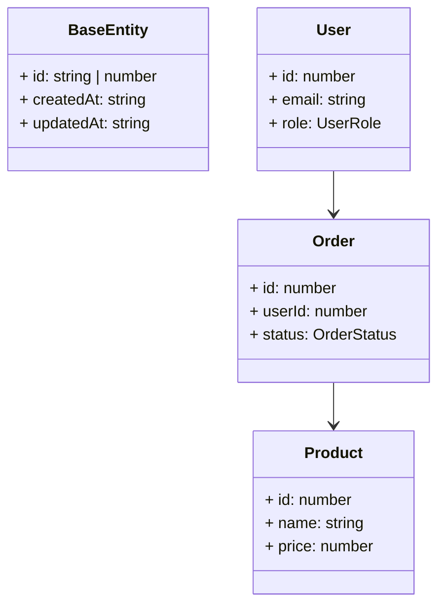

## Overview

The application uses a **layout-driven component architecture** with three primary layout shells (Public, Auth, Protected) and a shared component library. Components are organized by reusability scope: global primitives, layout shells, and feature-specific compositions. Routes are grouped by layout with role-based access control and lazy loading; entity data models are summarized at the name-and-purpose level (not full field listings).

---

## 1. Layout Components

### PublicLayout
**File:** `components/layout/PublicLayout/PublicLayout.tsx`
**Purpose:** Wrapper for public-facing pages (landing, about, pricing). Includes Navbar and Footer but no sidebar.

```tsx

interface PublicLayoutProps {
  children: React.ReactNode;
  className?: string;
}

export function PublicLayout({ children, className }: PublicLayoutProps) {
  return (
    <div className={cn('min-h-screen flex flex-col', className)}>
      <Navbar />
      <main className="flex-1">{children}</main>
      <Footer />
    </div>
  );
}
```

### AuthLayout
**File:** `components/layout/AuthLayout/AuthLayout.tsx`
**Purpose:** Centered, distraction-free wrapper for authentication pages (login, register, password reset).

```tsx

interface AuthLayoutProps {
  title: string;
  subtitle?: string;
  children: React.ReactNode;
}

export function AuthLayout({ title, subtitle, children }: AuthLayoutProps) {
  return (
    <div className="min-h-screen grid place-items-center bg-gray-50 p-6">
      <div className="w-full max-w-md space-y-6">
        <header className="text-center">
          <h1 className="text-2xl font-semibold">{title}</h1>
          {subtitle && <p className="mt-2 text-sm text-gray-500">{subtitle}</p>}
        </header>
        {children}
      </div>
    </div>
  );
}
```

### ProtectedLayout
**File:** `components/layout/ProtectedLayout/ProtectedLayout.tsx`
**Purpose:** Authenticated app shell with a collapsible sidebar, topbar, and main content outlet.

```tsx

interface ProtectedLayoutProps {
  children: React.ReactNode;
}

export function ProtectedLayout({ children }: ProtectedLayoutProps) {
  return (
    <div className="min-h-screen flex">
      <Sidebar />
      <div className="flex-1 flex flex-col">
        <Topbar />
        <main className="flex-1 p-6">{children}</main>
      </div>
    </div>
  );
}
```

---

## 2. Component Composition Tree



The tree groups components by scope: global primitives (Button, Input, Modal), layout shells, and feature-specific compositions under their owning route.

---

## 3. Route Tree

```mermaid
graph TD
    Root[/] --> PublicRoutes[Public Routes]
    Root --> AuthRoutes[Auth Routes]
    Root --> ProtectedRoutes[Protected Routes]

    PublicRoutes --> PublicLayout[PublicLayout]
    PublicLayout --> Landing[/]
    PublicLayout --> About[/about]
    PublicLayout --> Pricing[/pricing]

    AuthRoutes --> AuthLayout[AuthLayout]
    AuthLayout --> Login[/login]
    AuthLayout --> Register[/register]

    ProtectedRoutes --> ProtectedLayout[ProtectedLayout]
    ProtectedLayout --> Dashboard[/dashboard]
    ProtectedLayout --> Users[/dashboard/users]
    ProtectedLayout --> Products[/dashboard/products]
    ProtectedLayout --> Orders[/dashboard/orders]
    ProtectedLayout --> Settings[/dashboard/settings]
```

---

## 4. Route Guards

### PublicRoute (Redirects Authenticated Users)
```tsx

import { Navigate, useLocation } from 'react-router-dom';
import { useAuthStore } from '@/stores/useAuthStore';

export function PublicRoute({ children }: { children: React.ReactNode }) {
  const { isAuthenticated } = useAuthStore();
  const location = useLocation();

  if (isAuthenticated) {
    const from = location.state?.from?.pathname || '/dashboard';
    return <Navigate to={from} replace state={{ from: location }} />;
  }

  return <>{children}</>;
}
```

### PrivateRoute (Redirects Unauthenticated Users)
```tsx

import { Navigate, useLocation } from 'react-router-dom';
import { useAuthStore } from '@/stores/useAuthStore';

export function PrivateRoute({ children }: { children: React.ReactNode }) {
  const { isAuthenticated, isLoading } = useAuthStore();
  const location = useLocation();

  if (isLoading) return <PageSkeleton />;

  if (!isAuthenticated) {
    return <Navigate to="/login" replace state={{ from: location }} />;
  }

  return <>{children}</>;
}
```

### RoleRoute (Role-Based Access Control)
```tsx

import { Navigate } from 'react-router-dom';
import { useAuthStore } from '@/stores/useAuthStore';

export function RoleRoute({ children, allowedRoles }: {
  children: React.ReactNode;
  allowedRoles: UserRole[];
}) {
  const { user, isAuthenticated } = useAuthStore();

  if (!isAuthenticated) return <Navigate to="/login" replace />;
  if (!user || !allowedRoles.includes(user.role)) return <Navigate to="/unauthorized" replace />;

  return <>{children}</>;
}
```

---

## 5. Lazy Loading

```tsx

import { Suspense, lazy, ComponentType } from 'react';

export function LazyPage<T extends ComponentType<any>>(importFn: () => Promise<{ default: T }>) {
  const Component = lazy(importFn);

  return function LazyPageWrapper(props: React.ComponentProps<T>) {
    return (
      <Suspense fallback={<PageSkeleton />}>
        <Component {...props} />
      </Suspense>
    );
  };
}
```

---

## 6. Entity Data Models

Data models are documented at the **entity level** (name + purpose) rather than full field listings. Shared API envelope types are reused across all entities.

```typescript

export interface BaseEntity {
  id: string | number;
  createdAt: string;
  updatedAt: string;
}

export interface ApiResponse<T> {
  data: T;
  message: string;
  status: number;
  timestamp: string;
}

export interface PaginatedResponse<T> extends ApiResponse<T[]> {
  meta: {
    page: number;
    limit: number;
    total: number;
    totalPages: number;
    hasNext: boolean;
    hasPrev: boolean;
  };
}
```

### Entity Overview

| Entity | Purpose | Key relations |
|--------|---------|---------------|
| `User` | Authenticated account with role-based permissions | owns `Order` |
| `Product` | Catalog item for sale | referenced by `Order` |
| `Order` | Purchase transaction | belongs to `User`, contains `Product` |

---

## 7. Route Metadata

```typescript

export interface RouteMeta {
  title: string;
  description?: string;
  breadcrumb?: string;
  requiredPermissions?: string[];
  roles?: UserRole[];
  layout?: 'public' | 'auth' | 'protected';
  icon?: string;
  hiddenInNav?: boolean;
}

export const routeMeta: Record<string, RouteMeta> = {
  '/': { title: 'Home', breadcrumb: 'Home', layout: 'public' },
  '/login': { title: 'Sign In', breadcrumb: 'Sign In', layout: 'auth' },
  '/dashboard': { title: 'Dashboard', breadcrumb: 'Dashboard', layout: 'protected', icon: 'home' },
  '/dashboard/users': { title: 'Users', breadcrumb: 'Users', layout: 'protected', roles: ['ADMIN', 'MANAGER'], icon: 'users' },
  '/dashboard/products': { title: 'Products', breadcrumb: 'Products', layout: 'protected', icon: 'box' },
  '/dashboard/orders': { title: 'Orders', breadcrumb: 'Orders', layout: 'protected', icon: 'shopping-cart' },
  '/dashboard/settings': { title: 'Settings', breadcrumb: 'Settings', layout: 'protected', icon: 'cog' },
};
```

---

## 8. Mermaid Class Diagram



