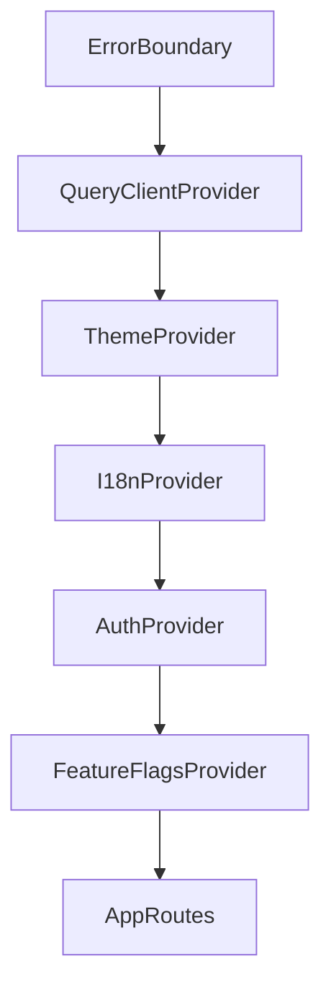

## Overview

Cross-cutting policies that span the whole application — authentication, theming, internationalization, error handling, logging, feature flags — plus the domain glossary and naming conventions that keep documentation and code consistent. These shared concerns are composed at the application root and available app-wide.

---

## 1. Provider Composition Tree

The application root composes all global providers in a fixed order so concerns wrap the entire tree.

```tsx

import { QueryClient, QueryClientProvider } from '@tanstack/react-query';
import { AuthProvider } from '@/features/auth/providers/AuthProvider';
import { ThemeProvider } from '@/providers/ThemeProvider';
import { I18nProvider } from '@/providers/I18nProvider';
import { ErrorBoundary } from '@/components/ui/ErrorBoundary';
import { FeatureFlagsProvider } from '@/providers/FeatureFlagsProvider';
import { AppRoutes } from '@/routes/routes';

export function App() {
  return (
    <ErrorBoundary>
      <QueryClientProvider client={queryClient}>
        <ThemeProvider>
          <I18nProvider>
            <AuthProvider>
              <FeatureFlagsProvider>
                <AppRoutes />
              </FeatureFlagsProvider>
            </AuthProvider>
          </I18nProvider>
        </ThemeProvider>
      </QueryClientProvider>
    </ErrorBoundary>
  );
}
```



---

## 2. Authentication

### AuthProvider
```tsx

import { useAuthStore } from '@/stores/useAuthStore';

export function AuthProvider({ children }: { children: React.ReactNode }) {
  const { user, isAuthenticated, isLoading } = useAuthStore();
  return <AuthContext.Provider value={{ user, isAuthenticated, isLoading }}>{children}</AuthContext.Provider>;
}
```

### Token Storage Strategy
- Access tokens live in memory where practical; refresh tokens are rotated and stored in `localStorage` (`auth-storage`).
- On refresh failure, the session is force-logged-out.

---

## 3. Theming System

### ThemeProvider
```tsx

export function ThemeProvider({ children }: { children: React.ReactNode }) {
  const theme = useAppStore((s) => s.theme);
  useEffect(() => {
    document.documentElement.dataset.theme = theme;
  }, [theme]);
  return <>{children}</>;
}
```

### CSS Variables (light + dark)
```css
:root {
  --color-surface: #ffffff;
  --color-foreground: #1a1a1a;
}
:root[data-theme="dark"] {
  --color-surface: #0b0f19;
  --color-foreground: #f8fafc;
}
```

---

## 4. Internationalization (i18n)

### I18nProvider
```tsx

export function I18nProvider({ children }: { children: React.ReactNode }) {
  const { locale } = useLocale();
  return <I18nextProvider i18n={configuredI18n(locale)}>{children}</I18nextProvider>;
}
```

### Translation Structure
- Locale files under `locales/<lang>/translation.json`, keyed by namespace and feature.

---

## 5. Error Boundaries & Global Error Reporting

### ErrorBoundary
```tsx

export class ErrorBoundary extends React.Component<Props, State> {
  state = { hasError: false };
  static getDerivedStateFromError() {
    return { hasError: true };
  }
  componentDidCatch(error: Error, info: ErrorInfo) {
    logger.error('unhandled-ui-error', { error: error.message, info });
  }
  render() {
    return this.state.hasError ? <ErrorFallback /> : this.props.children;
  }
}
```

- A route-level boundary resets on navigation; a global boundary shows a fallback with a "reload" action and reports the error.

---

## 6. Logging Configuration

### Logger (`utils/logger.ts`)
```ts

export const logger = {
  info: (msg: string, ctx?: Record<string, unknown>) => console.info(`[info] ${msg}`, ctx),
  warn: (msg: string, ctx?: Record<string, unknown>) => console.warn(`[warn] ${msg}`, ctx),
  error: (msg: string, ctx?: Record<string, unknown>) => console.error(`[error] ${msg}`, ctx),
};
```

- Level is environment-gated: `debug`/`info` in development, `warn`/`error` in production; structured context objects are preferred.

---

## 7. Feature Flags

### FeatureFlagsProvider
```tsx

export function FeatureFlagsProvider({ children }: { children: React.ReactNode }) {
  const flags = useRemoteConfig();
  return <FeatureFlagContext.Provider value={flags}>{children}</FeatureFlagContext.Provider>;
}
```

- Flags are loaded from remote config with local defaults; UI toggles are feature-flagged via a `<Flag name="...">` guard.

---

## 8. Glossary

| Term | Definition |
|------|------------|
| <Term 1> | <Domain definition, with citation to its source> |
| <Term 2> | <Domain definition, with citation to its source> |
| <Term 3> | <Domain definition, with citation to its source> |

---

## 9. Acronyms & Abbreviations

| Acronym | Expanded Form | Definition |
|---------|---------------|------------|
| <ACRONYM> | <Full name> | <Definition> |
| <ACRONYM> | <Full name> | <Definition> |

---

## 10. Naming Conventions

| Scope | Convention | Example |
|-------|-----------|---------|
| Files & directories | kebab-case for folders, PascalCase for component files | `components/layout/ProtectedLayout.tsx` |
| Components | PascalCase | `OrderForm` |
| Hooks | camelCase prefixed with `use` | `useOrders` |
| Stores | camelCase prefixed with `use` + `Store` suffix | `useAppStore` |
| API clients | camelCase suffixed with `Api` | `orderApi` |
| Routes paths | kebab-case, lowercase | `/dashboard/users` |
| Git branches | `type/scope` e.g. `feat/checkout` | `feat/order-detail` |

---

## 11. Domain-Specific Terms

| Domain | Terms |
|--------|-------|
| Authentication & Authorization | session, token, role, permission, refresh, OAuth |
| Users & Roles | admin, manager, customer, membership |
| Products & Catalog | SKU, inventory, variant, pricing |
| Orders & Transactions | checkout, line item, fulfillment, refund |
| State Management | store, selector, persistence, hydration |
| API & Networking | endpoint, pagination, idempotency, rate limit |
| UI/UX | component, design token, accessibility (a11y) |
| DevOps & Operations | CI/CD, deployment, observability, incident |
