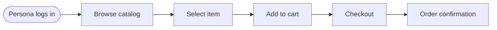

## Overview

Complete catalog of business features with user personas, end-to-end journeys, user stories, acceptance criteria, and technical implementation mapping. Each feature is traced to its components, hooks, stores, and API endpoints.

---

## 1. Feature Catalog

| Feature | Description | Priority | Status | Owner | Related Components |
|---------|-------------|----------|--------|-------|-------------------|
| **<Feature 1 Name>** | <One-line description of feature 1> | <P0/P1/P2/P3> | <✅ Done / 🚧 In Progress / 📋 Planned> | <Owner / Team> | `<Component>`, `<useHook>`, `<api>` |
| **<Feature 2 Name>** | <One-line description of feature 2> | <P0/P1/P2/P3> | <✅ Done / 🚧 In Progress / 📋 Planned> | <Owner / Team> | `<Component>`, `<useHook>`, `<api>` |
| **<Feature 3 Name>** | <One-line description of feature 3> | <P0/P1/P2/P3> | <✅ Done / 🚧 In Progress / 📋 Planned> | <Owner / Team> | `<Component>`, `<useHook>`, `<api>` |

---

## 2. User Personas

| Persona | Role | Goals | Pain Points | Key Features |
|---------|------|-------|-------------|--------------|
| **<Persona 1 Name>** | <Role / department> | <Goal 1>, <Goal 2> | <Pain point 1> | <Feature X>, <Feature Y> |
| **<Persona 2 Name>** | <Role / department> | <Goal 1>, <Goal 2> | <Pain point 2> | <Feature Z> |

---

## 3. End-to-End Journeys



Document the primary happy-path journey and key alternate/error paths per feature, each traced to the components and state involved.

---

## 4. Feature Specifications

<!-- Repeat the structure below for each feature in the catalog -->

### 4.1 <Feature 1 Name>

#### User Stories
```gherkin
Feature: <Feature 1 Name>

  Scenario: <Primary happy path scenario>
    Given <precondition or state>
    When <user action is performed>
    Then <expected primary outcome>
    And <additional state change or persistence>

  Scenario: <Alternative / failure path scenario>
    Given <precondition or invalid state>
    When <user action is attempted>
    Then <expected error message or feedback>
    And <state remains safe / unchanged>
```

#### Acceptance Criteria
| ID | Criterion | Status |
|----|-----------|--------|
| <FEAT-01> | <Specific verifiable criterion 1> | <✅ Done / 🚧 In Progress / 📋 Planned> |
| <FEAT-02> | <Specific verifiable criterion 2> | <✅ Done / 🚧 In Progress / 📋 Planned> |
| <FEAT-03> | <Specific verifiable criterion 3> | <✅ Done / 🚧 In Progress / 📋 Planned> |

#### Technical Mapping
| Layer | Implementation |
|-------|----------------|
| **Components** | `<ComponentList>`, `<ComponentForm>`, `<ComponentDetail>` |
| **Hooks** | `<useFeature>`, `<useFeatureDetail>`, `<useFeatureMutations>` |
| **Store** | `<useFeatureStore>` (<state shape, actions, selectors>) |
| **API** | `<featureApi.list>`, `<featureApi.get>`, `<featureApi.create>`, `<featureApi.update>` |
| **Routes** | `<Route path for feature>` |
| **Guards / Permissions** | `<PublicRoute / PrivateRoute / RoleRoute allowed roles>` |

---

## 5. Business Rules & Invariants

| Rule | Description | Enforcement |
|------|-------------|-------------|
| **<Rule 1 Name>** | <Description of business rule or constraint> | <DB constraint / API validation / UI check> |
| **<Rule 2 Name>** | <Description of business rule or constraint> | <DB constraint / API validation / UI check> |

---

## 6. Edge Cases & Error Scenarios

| Scenario | Expected Behavior |
|----------|-------------------|
| <Edge case scenario 1> | <Expected handling, error toast, or rollback behavior> |
| <Edge case scenario 2> | <Expected handling, error toast, or rollback behavior> |
| <Edge case scenario 3> | <Expected handling, error toast, or rollback behavior> |

---

*All feature specifications extracted from source code and documentation. See individual source citations for exact file locations.*
