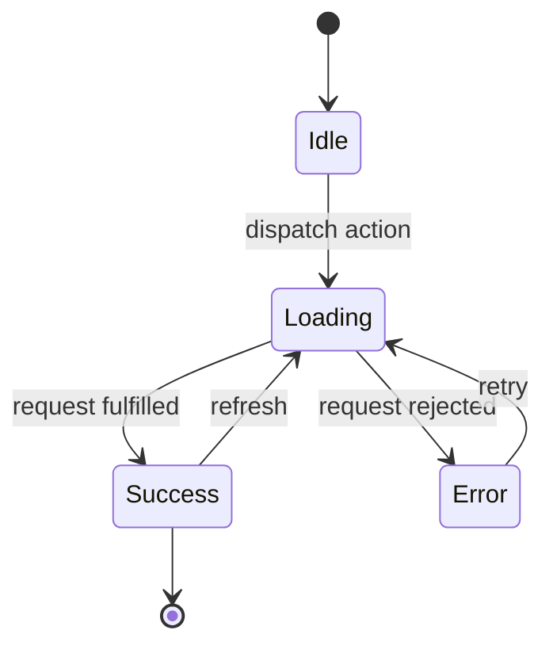

## Overview

This application uses **Zustand** for global state management — a lightweight, TypeScript-first solution with minimal boilerplate. State is organized into domain-specific stores with clear boundaries and persistence strategies; data models are captured at the entity level and data fetching is centralized in hooks and selectors.

---

## 1. Store Architecture

```
stores/
├── useAuthStore.ts      # Authentication & user session
├── useAppStore.ts       # App-wide UI state (theme, sidebar, toasts)
├── useFeatureStore.ts   # Feature-specific stores (lazy-loaded)
├── middleware/
│   ├── persist.ts       # Persist middleware configuration
│   ├── logger.ts        # Development logging
│   └── immer.ts         # Immutable updates with Immer
└── index.ts             # Barrel exports
```

---

## 2. Auth Store (`stores/useAuthStore.ts`)

### State Shape
```typescript

interface AuthState {
  // State
  user: User | null;
  tokens: AuthTokens | null;
  isAuthenticated: boolean;
  isLoading: boolean;
  error: ErrorResponse | null;

  // Computed (selectors)
  permissions: string[];
  isAdmin: boolean;
  isManager: boolean;

  // Actions
  login: (credentials: LoginCredentials) => Promise<void>;
  register: (data: RegisterCredentials) => Promise<void>;
  logout: () => void;
  refreshTokens: () => Promise<void>;
  updateUser: (user: Partial<User>) => void;
  clearError: () => void;
  setLoading: (loading: boolean) => void;
}
```

### Implementation
```typescript

import { create } from 'zustand';
import { persist, createJSONStorage } from 'zustand/middleware';
import { authApi } from '@/features/auth/api/authApi';

export const useAuthStore = create<AuthState>()(
  persist(
    (set, get) => ({
      user: null,
      tokens: null,
      isAuthenticated: false,
      isLoading: false,
      error: null,

      // Selectors (derived state)
      get permissions() {
        const { user } = get();
        return !user ? [] : ROLE_PERMISSIONS[user.role] || [];
      },
      get isAdmin() {
        return get().user?.role === 'ADMIN';
      },
      get isManager() {
        const r = get().user?.role;
        return r === 'ADMIN' || r === 'MANAGER';
      },

      login: async (credentials) => {
        set({ isLoading: true, error: null });
        try {
          const response = await authApi.login(credentials);
          set({
            user: response.data.user,
            tokens: response.data.tokens,
            isAuthenticated: true,
            isLoading: false,
          });
          get().scheduleTokenRefresh();
        } catch (error) {
          set({ error: normalizeError(error), isLoading: false });
          throw error;
        }
      },

      logout: () => {
        authApi.clearTokens();
        set({ user: null, tokens: null, isAuthenticated: false, error: null });
      },

      refreshTokens: async () => {
        const { tokens } = get();
        if (!tokens?.refreshToken) return;
        try {
          const response = await authApi.refreshToken(tokens.refreshToken);
          set({ tokens: response.data.tokens });
        } catch {
          get().logout();
        }
      },

      updateUser: (userData) => {
        const { user } = get();
        if (user) set({ user: { ...user, ...userData } });
      },

      clearError: () => set({ error: null }),
      setLoading: (loading) => set({ isLoading: loading }),

      scheduleTokenRefresh: () => {
        const { tokens } = get();
        if (!tokens) return;
        const refreshAt = (tokens.expiresIn - 60) * 1000; // 1 min before expiry
        setTimeout(() => get().refreshTokens(), refreshAt);
      },
    }),
    {
      name: 'auth-storage',
      storage: createJSONStorage(() => localStorage),
      partialize: (state) => ({
        user: state.user,
        tokens: state.tokens,
        isAuthenticated: state.isAuthenticated,
      }),
    }
  )
);
```

---

## 3. App Store (`stores/useAppStore.ts`)

```typescript

interface AppState {
  theme: 'light' | 'dark';
  sidebarOpen: boolean;
  toasts: Toast[];
  setTheme: (theme: 'light' | 'dark') => void;
  toggleSidebar: () => void;
  pushToast: (toast: Toast) => void;
  dismissToast: (id: string) => void;
}

export const useAppStore = create<AppState>()((set) => ({
  theme: 'light',
  sidebarOpen: true,
  toasts: [],
  setTheme: (theme) => set({ theme }),
  toggleSidebar: () => set((s) => ({ sidebarOpen: !s.sidebarOpen })),
  pushToast: (toast) => set((s) => ({ toasts: [...s.toasts, toast] })),
  dismissToast: (id) => set((s) => ({ toasts: s.toasts.filter((t) => t.id !== id) })),
}));
```

---

## 4. Selectors & Derived State

Selectors keep components decoupled from store shape and prevent unnecessary re-renders.

```tsx

export const selectIsAdmin = (s: AuthState) => s.user?.role === 'ADMIN';
export const selectPermissions = (s: AuthState) =>
  s.user ? ROLE_PERMISSIONS[s.user.role] || [] : [];

// Usage
const isAdmin = useAuthStore(selectIsAdmin);
```

---

## 5. Data Fetching Hooks

Server state is fetched through dedicated hooks backed by the API client, with derived data selected into components.

```tsx

export function useProducts() {
  const { data, isLoading, error } = useQuery({
    queryKey: ['products'],
    queryFn: () => apiClient.get('/products'),
  });
  return { products: data, isLoading, error };
}
```

---

## 6. State Flow Diagram



---

## 7. Persistence Strategy

- **Auth session** — persisted to `localStorage` under `auth-storage` (user, tokens, auth flag). Tokens auto-refresh ~1 min before expiry.
- **UI preferences** — theme and sidebar state persisted; toasts are ephemeral and not persisted.
- **Feature/cache state** — lazy-loaded feature stores persist only where the domain requires durable state.

| Store | Persist? | Key | Sensitive? |
|-------|----------|-----|------------|
| `useAuthStore` | Yes | `auth-storage` | Yes (tokens) — store in memory where possible, rotate refresh tokens |
| `useAppStore` | Partial | `app-storage` | No |
| `useFeatureStore` | Selective | per feature | Varies |

