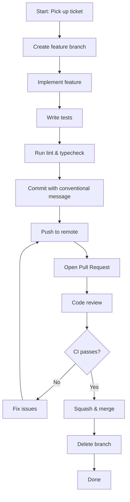
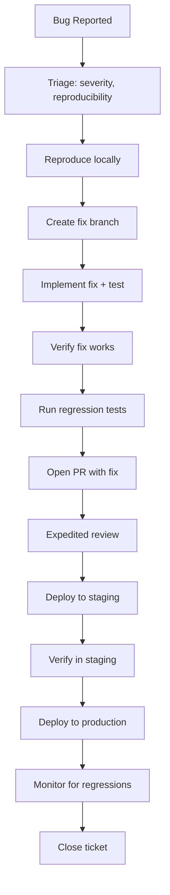
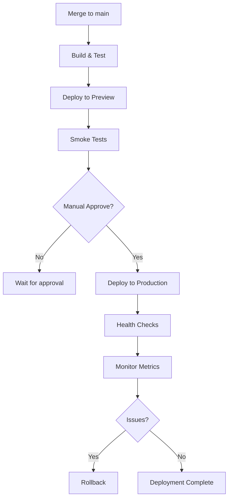
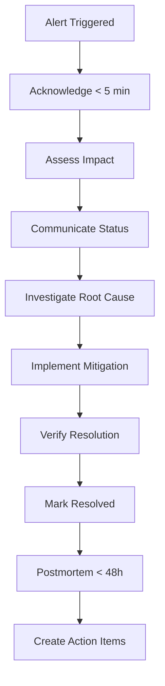

## Overview

Standardized operational procedures for development, testing, deployment, and incident response. Each workflow includes triggers, preconditions, steps, decision points, and rollback procedures.


---

## 1. Development Workflows

### 1.1 Feature Development



**Steps:**
1. **Pick up ticket** — Assign in Jira/Linear, move to "In Progress"
2. **Create branch** — `git checkout -b feat/JIRA-123-short-description`
3. **Implement** — Follow component architecture, add tests
4. **Test locally** — `npm test`, `npm run lint`, `npm run typecheck`
5. **Commit** — `git commit -m "feat(scope): description"` (conventional commits)
6. **Push** — `git push origin feat/JIRA-123-short-description`
7. **Open PR** — Fill template, link ticket, request reviewers
8. **Code review** — Address comments, push fixes
9. **Merge** — Squash and merge after approvals + CI pass
10. **Cleanup** — Delete local and remote branch

**Preconditions:** Ticket defined, dependencies resolved, design approved

**Decision Points:**
- CI fails → Fix and re-push
- Reviewer requests changes → Address and push
- Conflicts with main → Rebase and resolve

**Rollback:** Revert merge commit, delete branch

---

### 1.2 Bug Fix Workflow



**Severity Levels:**
| Level | Response Time | Example |
|-------|---------------|---------|
| **P0 (Critical)** | < 1 hour | Data loss, security, complete outage |
| **P1 (High)** | < 4 hours | Major feature broken, many users affected |
| **P2 (Medium)** | < 24 hours | Minor feature broken, workaround exists |
| **P3 (Low)** | Next sprint | Cosmetic, edge case, enhancement |

---

### 1.3 Code Review Checklist

- [ ] **Functionality** — Does it solve the problem? Edge cases handled?
- [ ] **Types** — TypeScript strict mode passes, no `any` without justification
- [ ] **Tests** — Unit tests for new logic, integration for API changes
- [ ] **Performance** — No unnecessary re-renders, lazy loading where appropriate
- [ ] **Accessibility** — Semantic HTML, ARIA labels, keyboard navigation
- [ ] **Security** — No secrets, input validation, XSS prevention
- [ ] **Documentation** — JSDoc for complex functions, README updates if needed
- [ ] **Dependencies** — No unused deps, no major version bumps without discussion
- [ ] **Breaking Changes** — Flagged in PR, migration guide if needed

---

## 2. Testing Workflows

### 2.1 Local Testing
```bash
# Run all tests
npm test

# Run with coverage
npm run test:coverage

# Run specific test file
npm test -- Button.test.tsx

# Watch mode
npm run test:watch
```

### 2.2 CI Pipeline (GitHub Actions)
```yaml
# .github/workflows/ci.yml
name: CI
on: [push, pull_request]
jobs:
  test:
    runs-on: ubuntu-latest
    steps:
      - uses: actions/checkout@v4
      - uses: actions/setup-node@v4
        with: { node-version: '20', cache: 'npm' }
      - run: npm ci
      - run: npm run lint
      - run: npm run typecheck
      - run: npm run test:coverage
      - run: npm run build
```

### 2.3 E2E Testing (Playwright)
```bash
# Install browsers
npx playwright install

# Run E2E tests
npm run test:e2e

# Run with UI
npm run test:e2e:ui
```

---

## 3. Deployment Workflows

### 3.1 Preview Deployment (Automatic on PR)
1. PR opened/updated → GitHub Actions triggers
2. Build runs → `npm run build`
3. Deploy to preview URL (Vercel/Netlify)
4. Comment posted on PR with preview link
5. Team reviews in preview environment

### 3.2 Production Deployment



**Manual Approval Required For:**
- Database migrations
- Breaking API changes
- Feature flag toggles affecting billing/auth
- Friday deployments (require explicit approval)

### 3.3 Rollback Procedure
```bash
# Vercel/Netlify: Instant rollback via dashboard
# Or CLI:
vercel rollback <deployment-url>

# Kubernetes:
kubectl rollout undo deployment/app-name

# Database (if migration):
# 1. Revert migration: npm run db:migrate:down
# 2. Deploy previous version
# 3. Verify data integrity
```

---

## 4. Release Workflows

### 3.4 Version Bumping (Conventional Commits)
```bash
# Automatic via semantic-release
# feat: -> MINOR
# fix: -> PATCH
# BREAKING CHANGE: -> MAJOR

# Manual (if needed):
npm version patch|minor|major
git push --follow-tags
```

### 3.5 Changelog Generation
```bash
# Auto-generated from conventional commits
npm run changelog

# Output: CHANGELOG.md
# ## [1.2.0] - 2024-01-15
# ### Features
# - Add user export functionality (JIRA-456)
# ### Fixes
# - Fix login redirect loop (JIRA-445)
```

---

## 4. Operational Procedures

### 4.1 Incident Response



**Communication Channels:**
- **Internal:** #incidents Slack channel
- **Status Page:** status.company.com
- **Customers:** Email for P0/P1 affecting users

### 4.2 Database Migration Procedure

```bash
# 1. Create migration
npm run db:migrate:create add_user_preferences

# 2. Review generated SQL
cat migrations/20240115_add_user_preferences.sql

# 3. Test locally
npm run db:migrate:up

# 4. Deploy migration (with app deploy)
# 5. Verify in staging
# 6. Deploy to production
# 7. Verify production
```

**Rules:**
- Always backward compatible (additive only)
- No `DROP COLUMN` in production without 2-release deprecation
- Test rollback before applying
- Run during low-traffic window

### 4.3 Cache Invalidation
```bash
# CDN purge (Vercel/Cloudflare)
vercel purge --token=$TOKEN

# React Query cache (client-side)
# Handled automatically via query invalidation

# API cache (Redis)
redis-cli FLUSHDB
```

---

## 5. Decision Trees

### 5.1 "Should I create a new component or extend existing?"
```
Is the variation purely visual (colors, spacing)?
  YES → Use variants/props on existing component
  NO → Does it have different behavior/state?
    YES → New component
    NO → Consider composition with existing
```

### 5.2 "Where should this logic live?"
```
Is it pure business logic?
  YES → Feature store or utility function
  NO → Is it UI state (modals, forms, toggles)?
    YES → Local component state or UI store
    NO → Is it server state (API data)?
      YES → TanStack Query + feature store
      NO → Cross-cutting (auth, theme, flags) → App store
```

### 5.3 "When to use a new feature folder vs shared?"
```
Is it used by multiple features?
  YES → Shared (components/ui, hooks, utils)
  NO → Feature-specific (features/featureName/)
```

---

## 6. Onboarding Checklist (New Developer)

- [ ] Clone repo, `npm install`
- [ ] Copy `.env.example` to `.env.local`, fill values
- [ ] Run `npm run dev`, verify app loads
- [ ] Run `npm test`, verify tests pass
- [ ] Review this documentation (Architecture, Components, State, Routing)
- [ ] Set up IDE (ESLint, Prettier, TypeScript)
- [ ] Complete first "Good First Issue"
- [ ] Pair program with buddy for first feature

---

